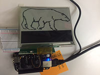
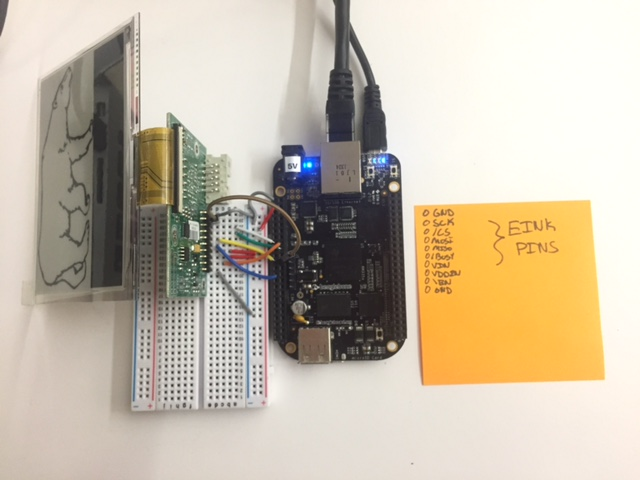

# PDEInkDriver

This repository is a very initial driver library for Pervasive Display's EInk Displays.

Currently this repository supports:

+ Pervasive Displays 4.41" Display
  + **Screen: [Pervasive Displays 4.41" Display](http://www.pervasivedisplays.com/products/441) - NOTE: Black/White display**
  + **Driver: [Pervasive Displays Mpico Driver](http://www.pervasivedisplays.com/kits/mpicosys441)**

Current platforms supported:

+ **Beaglebone Black**

# Features

Example video:

The driver includes support for:

+ Filling Regions
+ Drawing Images
+ Partial Updates
+ Multiple Screen Support
+ Full Flash and Flashless Updates

# Setup

### CMake

This library depends on cmake to build.

To install on beaglebone use: `opkg update; opkg install cmake`

### SPIDEV

The pervasive display EInk Displays use SPI to communicate with the controlling device.

For beaglebone, see [this](http://elinux.org/BeagleBone_Black_Enable_SPIDEV) for how to setup SPIDEV0 device properly.

# Wiring

### 4.41" EInk Display on Beaglebone Black

+ GND -> P9_2
+ SCK -> P9_22
+ /CS -> P9_15
+ MOSI -> P9_18
+ MISO -> P9_21
+ /BUSY -> P9_25
+ VIN -> P9_3
+ VDDIN -> P9_4
+ /EN -> P9_16
+ GND -> P9_1 

Image of example wiring:

# Installation

+ Clone this repo to device you want to run it on
+ Go into the repo: `cd PDEInkDriver`
+ Create the build directory: `mkdir build`
+ Go Into the Build Directory: `cd build`
+ Configure the makefile for the platform: `cmake ..`
+ Make the library: `make`
+ Simple Test of the library: `./test/test_pdeinkdriver_simple_test`
+ Image Test of the library: `./test/test_pdeinkdriver_image_test`

# Usage 

This library currently assumes the EInk Display is attached to SPI on device /dev/spidev1.0. The chip select, enable, and busy lines can all be configured. The chip select can be used to control multiple screens with one device.

See the tests for basic usage.
